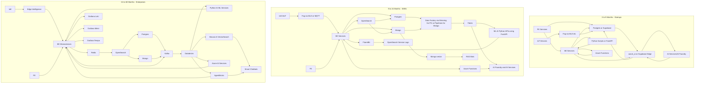

# ArchDiagrams
ArchPlans and diagrams

```mermaid
flowchart TB

subgraph S1["3 to 9 Months - Startups"]
    FE1[FE Services]
    BE1[BE Services]
    IoT1[IoT Devices]
    Fog1[Fog via BLE etc]
    PG1[Postgres or Supabase]
    PY1[Python Scripts or FastAPI]
    AIF[AI Services/AI Foundry]
    AII[azure_ai or Supabase Edge]
    AF1[Azure Functions]

    FE1 --> PG1
    BE1 --> PG1
    IoT1 --> Fog1
    Fog1 --> PG1
    BE1 --> PY1
    PY1 --> BE1
    BE1 --> AF1
    AF1 --> BE1
    PG1 --> AII
    AII --> AIF
    AIF --> AII
    AII --> PG1
    BE1 --> AII
    FE1 --> BE1
end

subgraph S2["9 to 24 Months - SMEs"]
    FE2[FE]
    BE2[BE Services]
    IoE2[IoE AIoT]
    Fog2[Fog via BLE or MQTT]

    OS2[OpenSearch]
    OS4[OpenSearch Service Logs]
    PG2[Postgres]
    MG2[Mongo]
    MGV[Mongo vector]
    RGB[RAG Bots]

    DF2[Data Factory via Mirroring for PG or Pipelines for Mongo]
    FB2[Fabric]

    ML2[ML AI Python APIs using FastAPI]
    AIF2[AI Foundry and AI Services]
    AF2[Azure Functions]

    FBt2[FluentBit]

    IoE2 --> Fog2
    Fog2 --> BE2
    FE2 --> BE2

    BE2 --> OS2
    BE2 --> PG2
    BE2 --> MG2
    BE2 --> AF2

    OS2 --> PG2
    OS2 --> MG2

    PG2 --> DF2
    MG2 --> DF2
    DF2 --> FB2

    MG2 --> MGV
    MGV --> RGB

    FB2 --> ML2
    ML2 --> BE2

    FB2 --> AIF2
    AF2 --> AIF2

    BE2 --> FBt2
    FBt2 --> OS4
end

subgraph S3["24 to 60 Months - Enterprises"]
    FE3[FE]
    BE3[BE Microservices]
    IoE3[IoE]
    Edge3[Edge Intelligence]

    RD3[Redis]
    OS3[OpenSearch]
    MG3[Mongo]
    MVS[Mosaic AI VectorSearch]
    PG3[Postgres]
    KF3[Kafka]


    DB3[Databricks]
    PY3[Python AI ML Services]
    AG3[AgentBricks]
    IB3[Smart Chatbots]
    AZ3[Azure AI Services]

    LK3[Grafana Loki]
    MM3[Grafana Mimir]
    TP3[Grafana Tempo]

    IoE3 --> Edge3
    Edge3 --> BE3
    FE3 --> BE3

    BE3 --> RD3
    RD3 --> OS3

    OS3 --> MG3
    OS3 --> PG3

    PG3 --> KF3
    MG3 --> KF3
    BE3 --> KF3

    KF3 --> DB3
    DB3 --> PY3
    PY3 --> BE3

    DB3 --> AG3
    AG3 --> BE3
    DB3 --> AZ3
    AZ3 --> BE3

    DB3 --> MVS
    MVS --> IB3
    AG3 --> IB3

    BE3 --> LK3
    BE3 --> MM3
    BE3 --> TP3
end
```
